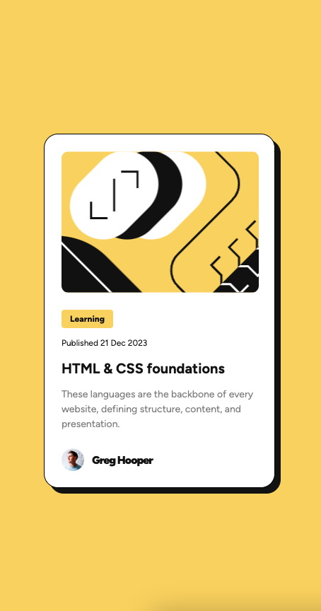
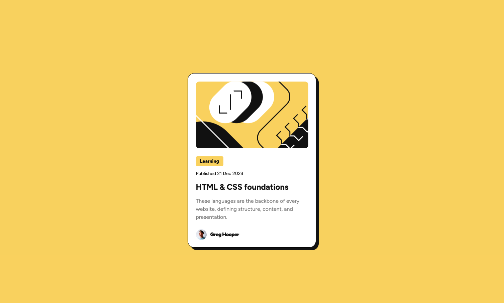
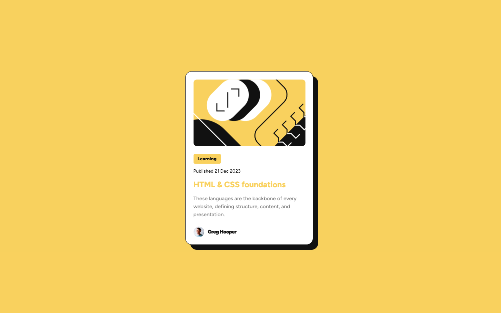

# Frontend Mentor - Blog preview card solution

This is a solution to the [Blog preview card challenge on Frontend Mentor](https://www.frontendmentor.io/challenges/blog-preview-card-ckPaj01IcS). Frontend Mentor challenges help you improve your coding skills by building realistic projects. 

## Table of contents

- [Overview](#overview)
  - [The challenge](#the-challenge)
  - [Screenshot](#screenshot)
  - [Links](#links)
- [My process](#my-process)
  - [Built with](#built-with)
  - [What I learned](#what-i-learned)
  - [Continued development](#continued-development)
  - [Useful resources](#useful-resources)
- [Author](#author)
- [Acknowledgments](#acknowledgments)

## Overview

### The challenge

Users should be able to:

- See hover and focus states for all interactive elements on the page

### Screenshot

### Links

- Solution URL: [Github Repo](https://github.com/muneer-ahmed-khan/frontend-mentor/tree/master/blog-preview-card-main)
- Live Site URL: [Githup pages live](https://muneer-ahmed-khan.github.io/frontend-mentor/blog-preview-card-main/)

## My process

### Built with

- Semantic HTML5 markup
- CSS custom properties
- Flexbox
- Mobile-first workflow

### What I learned

I have learned the flex box hover effects, fixel perfect designs.

### Continued development

I will continue to create new design to improve the UI skills.

## Author

- Frontend Mentor - [@muneer-ahmed-khan](https://www.frontendmentor.io/profile/@muneer-ahmed-khan)
- Github Profile - [@muneer-ahmed-khan](https://github.com/muneer-ahmed-khan/)

