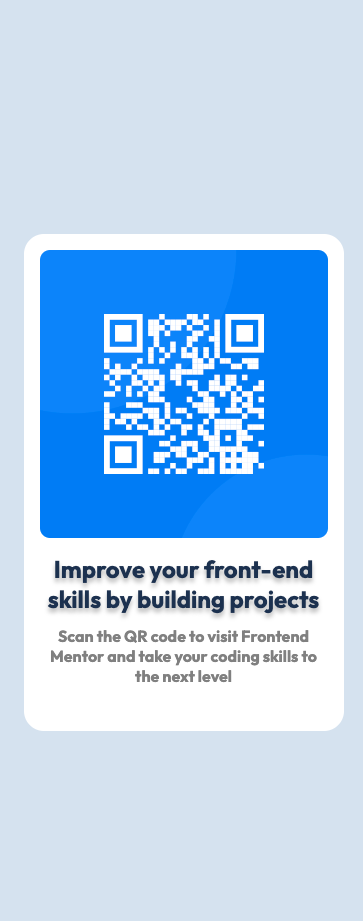

# Frontend Mentor - QR code component solution

This is a solution to the [QR code component challenge on Frontend Mentor](https://www.frontendmentor.io/challenges/qr-code-component-iux_sIO_H).

## Table of contents

- [Overview](#overview)
  - [Screenshot](#screenshot)
  - [Links](#links)
- [My process](#my-process)
  - [Built with](#built-with)
  - [What I learned](#what-i-learned)
  - [Continued development](#continued-development)
  - [Useful resources](#useful-resources)
- [Author](#author)
- [Acknowledgments](#acknowledgments)

## Overview

### Screenshot

### Links

- Solution URL: [Github Repo](https://github.com/muneer-ahmed-khan/frontend-mentor/tree/master/qr-code-component-main)
- Live Site URL: [Visit live Url](https://qr-code-component-main-test.netlify.app/)

## My process

### Built with

- Semantic HTML5 markup
- CSS custom properties
- Flexbox
- Mobile-first workflow

### What I learned

I have created a accurate UI from figma design given to complete the task. 

### Continued development

I continue my focus on UI development and design.

### Useful resources

- [Flexbox](https://css-tricks.com/snippets/css/a-guide-to-flexbox/) - help me with flexbox.
- [Flexbox Froggy](https://codepip.com/games/flexbox-froggy/) - a game that help me understand flexbox.

## Author

- Frontend Mentor - [@muneer-ahmed-khan](https://www.frontendmentor.io/profile/muneer-ahmed-khan)

## Acknowledgments

Get basic help from frontend mentor.
